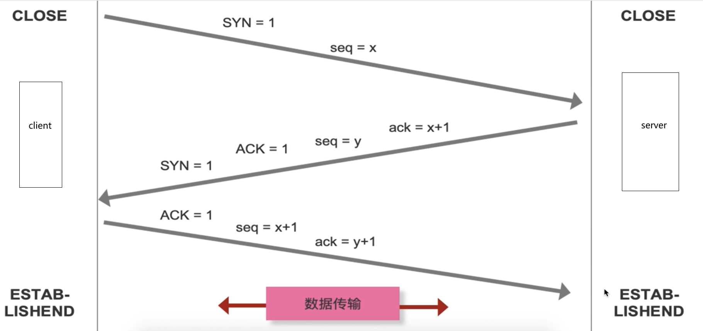
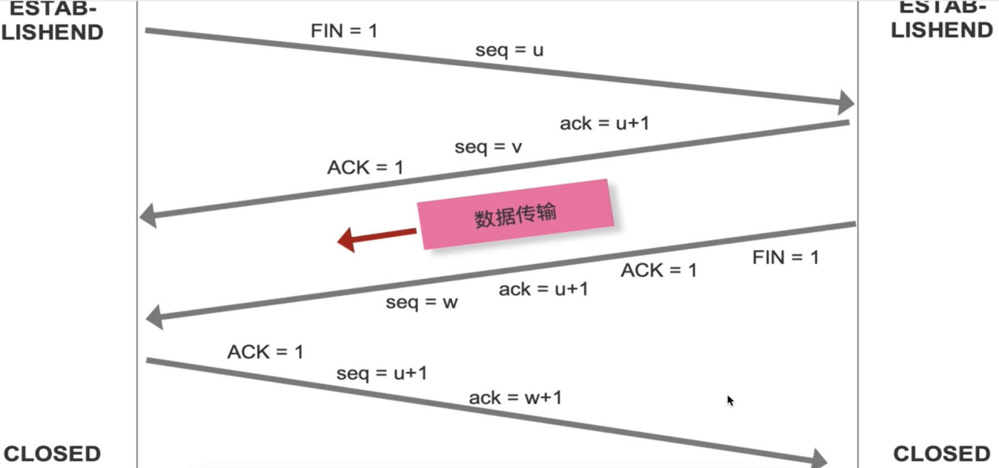

### url解析 url编码
  + encodeURI：解决中文空格问题
  + encodeURIComponent：解决中文空格问题+转义特殊符号（//）
  + (略)URI/URN/url的区别


### dns解析
**性能优化，预解析 ```<link rel="dns-prefetch" href="xxx.com">```**
  + 递归查询：浏览器缓存 -> 本地hosts文件 -> 本地Dns解析器缓存 -> 本地Dns缓存服务器

  + 迭代查询：
  
   
### tcp/ip协议
  + tcp 传输通道
  + ip 找到主机地址
  + http 传输协议
  + tcp的可靠性的机制：
    + 流量控制：避免接收者接收不过来
    + 拥塞控制：防止传输的数据太多


### tcp三次握手
  + seq序号：识别从tcp源端向目的端发送的字节流，发送数据时对这个进行标记
  + ack确人标志序号：只有ACK标志位为1时，确认信号才有效，ack=sep+1
  + 标志位： 
    + ACK： 确认序号有效
    + SYN：发起一个新连接
    + FIN：释放一个连接
    + RST： 重置连接

   

 ### 缓存检查

``` js
    if(有强缓存，有效){
      ...强缓存
    }else if(强缓存失效 || 无强缓存){
      if(有协商缓存，有效){
        ...协商缓存
      }else{
        ...重新请求数据
      }
    }
```


### 四次挥手


### 页面渲染

